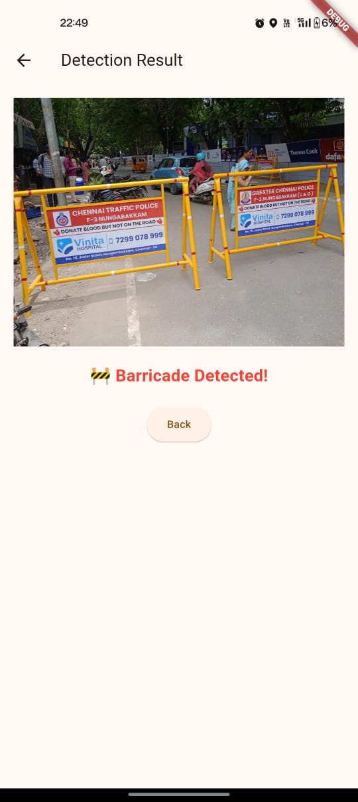
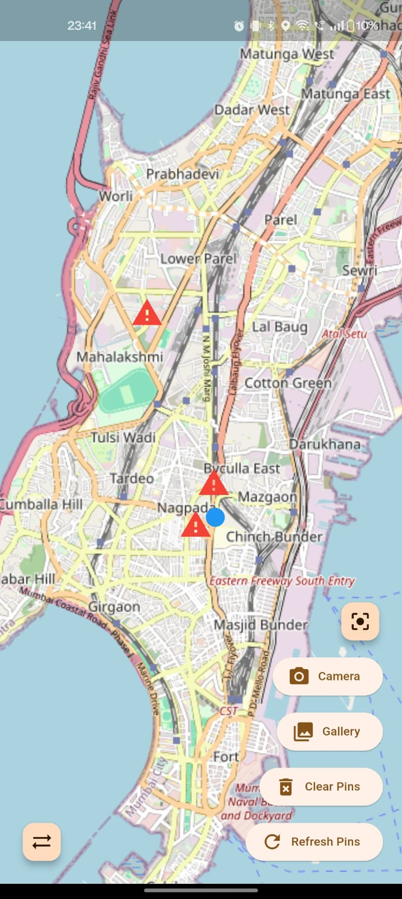
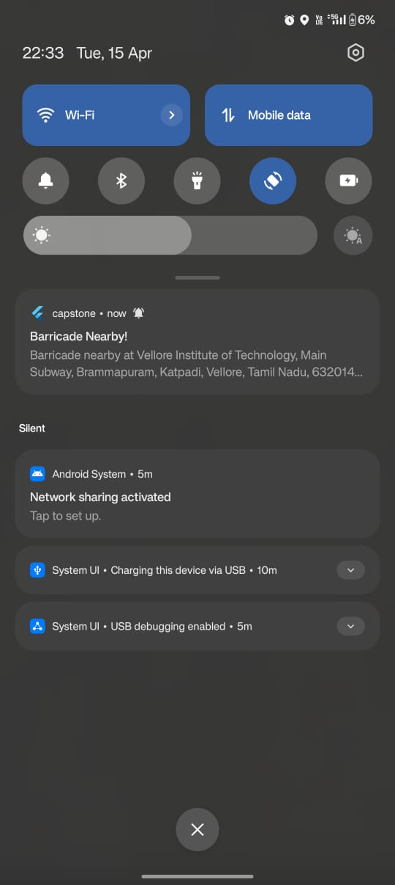
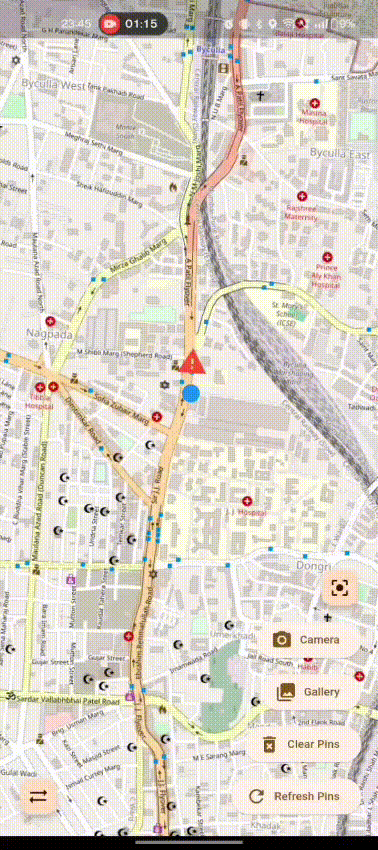

# BarricAid 🚧

A real-time barricade detection app built with Flutter & Flask. Designed to alert drivers about nearby roadblocks using ML, maps, and location services.

## Features
- 🔍 Real-time barricade detection using YOLOv11.
- 🗺️ Live map with socket-based pin updates.
- 📸 Upload photos from camera/gallery for detection.
- 🚨 Alerts users with sound + notifications within 100m of barricades.
- 📡 Background location tracking.
- 🔄 Developer/User mode switch.

## Tech Stack
- **Flutter** (Frontend)S
- **Flask** + **YOLOv11** (Backend & ML)
- **Socket.IO** (Real-time updates)
- **Geopy** (Address generation)

## Cloud Infrastructure

The backend Flask server is hosted on an **Amazon EC2 instance**, providing a scalable and reliable environment for the API that processes document uploads and serves data to the Flutter app.

## 📱 Screenshots

<p float="left">
  
  
  
  
</p>


## Getting Started
Clone the repo:
```bash
git clone https://github.com/faiz3544/BarricAid.git
